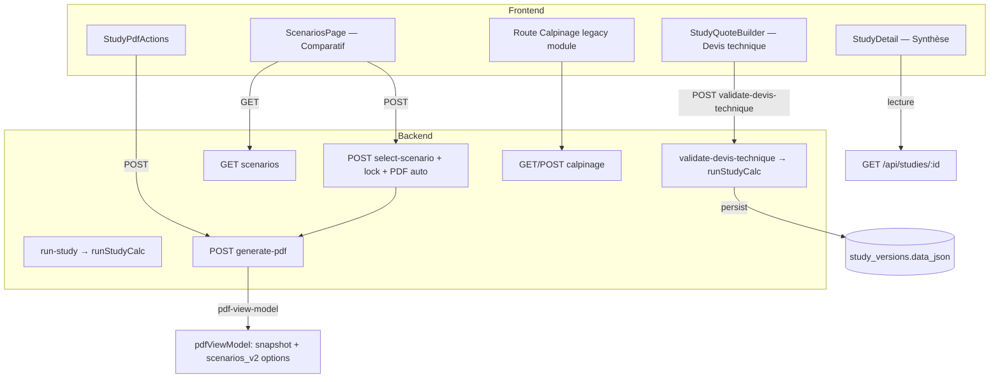

# Audit complet — Page Étude / Synthèse (lead)

**Périmètre :** `StudyDetail.tsx`, `ScenariosPage.tsx`, composants PDF / comparatif / graphiques, API ` /api/studies/:studyId/versions/:versionId/*`, moteur calcul (`calc.controller.js`, `scenarioV2Mapper.service.js`, `solarnextPayloadBuilder.service.js`, `batteryService.js`).  
**Date :** 2025-03-20 (codebase `smartpitch-v3`).  
**Méthode :** lecture statique du code et des routes ; croisement avec la doc interne existante (`DIAGNOSTIC_P7_*`, `AUDIT_P8_*`, etc.).

---

## 1. Cartographie fonctionnelle (vue d’ensemble)

---

## 2. Partie 1 — Inventaire des boutons et actions UI

Légende des colonnes : **VISIBLE_CONDITION** résume les garde-fous évidents dans le code.

### StudyDetail (`frontend/src/pages/StudyDetail.tsx`)

| BUTTON_ID | LABEL | POSITION_UI | VISIBLE_CONDITION | ON_CLICK_HANDLER | API_CALL | STATE_CHANGE | DATA_IMPACT | EXPECTED_BEHAVIOR | ACTUAL_BEHAVIOR | BUGS | RISKS |
|-----------|-------|-------------|-------------------|------------------|----------|--------------|-------------|-------------------|-----------------|------|-------|
| `back_lead` | « ← Retour Lead » | Header gauche | `data` chargé | `navigate(/leads/:lead_id)` ou `navigate(-1)` | Aucune | Navigation | Aucune | Retour CRM lead | Idem | — | Perte contexte si pas de `lead_id` |
| `delete_study` | « Effacer l'étude » | Header droite | `study.lead_id` défini | `handleDeleteStudy` | `DELETE /api/studies/:studyId` | `navigate(/leads/:leadId)` | Suppression étude | Confirmation puis suppression | Idem | Double `confirm` non localisé côté copy | Irréversible ; erreur = `alert` |
| `version_fix_nav` | « Voir l'étude (dernière version) » | Bandeau jaune | `versionNotFound` | `navigate` vers dernière version | Aucune | URL corrigée | Aucune | Corrige URL UUID invalide | Idem | — | Confusion si plusieurs versions |
| `scenarios_compare` | « Comparer les scénarios » | Bloc scénarios | `selectedVersion` défini | `navigate(.../scenarios)` | Aucune (page suivante charge les données) | Navigation | Aucune | Ouvre comparatif | Idem | Bouton actif même si `scenarios_v254` vide (page gérera l’erreur ou liste vide) | Clic → 404 scénarios si jamais validé |
| `calpinage_open` | « Ouvrir le calpinage » | Bloc calpinage | Toujours (désactivé si pas `studyId`/`selectedVersion` implicite) | `navigate(.../calpinage)` | Aucune | Navigation | Aucune | Éditeur calpinage | Idem | — | Pas d’indication « recalcul requis » si geometry changée après calcul |
| `calpinage_reset` | « Réinitialiser calpinage » | Bloc calpinage | `studyId && selectedVersion.id` | `handleResetCalpinage` | `POST .../reset-calpinage` | `reload` | Reset serveur calpinage version | Confirm puis reset | Idem | — | Incohérence avec `scenarios_v2` tant que pas re-validé |
| `quote_prep_open` | « Préparer le devis » | Bloc préparation | Toujours si IDs OK | `navigate(.../quote-builder)` | Aucune | Navigation | — | Accès quote-prep | Idem | — | Découplage fort : le « calcul » n’est pas sur cette page |
| `quote_reset` | « Réinitialiser devis » | Idem | `studyId && selectedVersion.id` | `handleResetQuote` | `POST .../reset-quote` | `reload` | Supprime snapshot éco / prep selon service | Confirm | Idem | — | Perte données prep |
| `quote_open` | « Ouvrir le devis » | Devis final | `firstQuote` existe | `navigate(/quotes/:id)` | Aucune | — | — | Ouvre devis | Idem | — | Ne montre qu’un seul devis (`studyQuotes[0]`) |
| `quote_create_disabled` | « Créer le devis final » | Devis final | Pas de devis | `disabled` | — | — | — | Création | **Non branché** (`title` indique POST /quotes) | Bouton fantôme | Attente produit / frustration |
| **StudyPdfActions** | Voir ci-dessous | Section documents | Si `studyId` + `versionId` | — | — | — | — | — | — | — | — |
| **DocumentUploader** | Upload / gestion fichiers | Section documents | Tant que `entityId` étude | Composant dédié | API documents | Liste documents | Stockage fichiers | Pièces jointes | Hors audit détaillé ici | — | — |

### StudyPdfActions (`frontend/src/components/study/StudyPdfActions.tsx`)

| BUTTON_ID | LABEL | VISIBLE_CONDITION | API | NOTES |
|-----------|-------|-------------------|-----|--------|
| `pdf_generate` | « Générer le PDF » | Aucun `latestPdf` | `POST .../generate-pdf` | Exige snapshot côté serveur (`SCENARIO_SNAPSHOT_REQUIRED` sinon toast) |
| `pdf_regenerate` | « Régénérer » | `latestPdf` présent | Idem | **Désactivé si `isLocked`** — cohérent pour éviter ambiguïté régénération |
| `pdf_view` | « Voir » | PDF listé | `GET .../documents/:id/download` puis blob URL | Ouvre onglet |
| `pdf_download` | « Télécharger » | Idem | Idem | Télécharge fichier |

**Fait notable :** si aucun PDF mais version verrouillée (ex. échec Playwright au `select-scenario`), le bouton « Générer le PDF » **n’est pas** désactivé par `isLocked` — filet de secours pour regénérer après coup.

### ScenariosPage (`frontend/src/pages/studies/ScenariosPage.tsx`)

| BUTTON_ID | LABEL | VISIBLE_CONDITION | API / ACTION |
|-----------|-------|-------------------|--------------|
| `back_study` | « Retour à l'étude » | Toujours (hors loading) | Navigation |
| `select_scenario_*` | « Choisir sans stockage / batterie… » | Par colonne via `ScenarioComparisonTable` | `POST .../select-scenario` body `{ scenario_id }` |
| *(état)* | Bandeau « Validation… PDF… » | `selectingId !== null` | Feedback UX |

`ScenarioComparisonTable` désactive le CTA si `selectionDisabled` (`versionLocked` ou `selectingId`), ou si badge `missing` / `unsuitable` pour la colonne.

### Navigation « entre versions »

- **Sur `StudyDetail` :** pas de sélecteur de version dans le JSX audité — la version active dépend de l’**URL** (`:versionId` UUID) ou de la **dernière** version du tableau `versions`.
- **Ailleurs (ex. Lead) :** navigation possible vers `/studies/:id/versions/:versionId/calpinage` (fichier `LeadDetail.tsx` repéré).

---

## 3. Partie 2 — Audit UX / esthétique (outil de vente)

### Hiérarchie visuelle

- Le **header** (numéro étude, client, email) est clair ; le badge « Étude » renforce le contexte.
- La **Synthèse** est structurée en 3 cartes (Production / Financier / Installation) — bon découpage thématique.
- **Problème :** plusieurs chiffres clés affichent **« — »** (autoconsommation, couverture, économie annuelle, orientation, inclinaison) alors que les données existent souvent dans `scenarios_v2` ou quote-prep — le regard **ne** converge **pas** vers des KPI décisionnels, mais vers des **trous**.

### Densité

- Grille synthèse : équilibrée ; sections suivantes (calpinage, devis, documents) : **répétition** de patron carte + bouton primaire — lisible mais **linéaire long** (scroll vertical important).
- **ScenariosPage** : traitement « premium » (bordure or, halo, titre dégradé) **plus travaillé** que la synthèse StudyDetail — risque de **dissonance** « page vitrine vs back-office ».

### Compréhension client sans oral

- Un **client final** ne voit pas cette UI (CRM interne). Pour un **commercial**, le chaînage **Calpinage → Préparer le devis → Valider (ailleurs) → Comparer → Choisir scénario → PDF** est **implicite** : la page Synthèse **ne nomme pas** l’étape « Valider le devis technique » comme **prérequis** au comparatif (message seulement sur `ScenariosPage` si `SCENARIOS_NOT_GENERATED`).

### Cohérence SolarGlobe

- `ScenariosPage` : glassmorphism / or aligné avec une direction « premium ».
- `StudyDetail` : `sn-card-premium` mais styles **majoritairement inline/local** ; moins « hero » que le comparatif.

### Comparatif scénarios

- **3 colonnes fixes** même si une option manque — bon pour comparer « emplacements » ; badges `missing` / `unsuitable` aident.
- Graphique économique sous le tableau : **aide** à la décision si données présentes.

### Zones confuses / sous-exploitées

- **TRI** et **ROI années** dans la carte Financier affichent la **même source** (`summarySource?.roi`) — voir incohérences §7.
- **Bouton** « Créer le devis final » désactivé sans explication métier riche (tooltip technique).

---

## 4. Partie 3 — Scénarios V2 (cœur métier)

### 4.1 Création — « Lancer calcul »

Sur la **page Synthèse**, il n’y a **pas** de bouton « Lancer calcul ».

Le flux **produit** identifié :

1. **Valider le devis technique** (`StudyQuoteBuilder`) → `POST /api/studies/:studyId/versions/:versionId/validate-devis-technique` (`validateDevisTechnique.controller.js`).
2. Alternative : `POST .../run-study` (`runStudy.controller.js`) — validations métier (lead, conso, adresse, calpinage snapshot ou géométrie complète, `economic_snapshots`) puis **`runStudyCalc`**.
3. Appel direct possible : `POST .../calc` avec `versionId` = **numéro** de version (**pas** l’UUID) dans `studyCalc.controller.js`.

**Payload calcul :** `runStudyCalc` construit `solarnext_payload` via `buildSolarNextPayload({ studyId, versionId: versionNum, orgId })` puis appelle `calculateSmartpitch` avec `{ solarnext_payload }`.

### 4.2 Structure `scenarios_v2` (mapper)

Chaque entrée est produite par `mapScenarioToV2(scenario, ctx)` dans `scenarioV2Mapper.service.js` — champs principaux **par scénario** :

| Bloc | Contenu (résumé) |
|------|------------------|
| Identité | `id` (`BASE` \| `BATTERY_PHYSICAL` \| `BATTERY_VIRTUAL`), `label`, `scenario_type`, `computed_at` |
| `energy` | production, conso, auto, surplus, import(s), mensuel, % autosuffisance / indépendance, champs spécifiques **BATTERY_VIRTUAL** (grid, crédit, overflow, `billable_*`) |
| `finance` | `capex_ttc`, `roi_years`, `payback`, `irr_pct`, `lcoe`, `annual_cashflows`, économies, résiduel, surplus, coût batterie virtuelle |
| `costs` | prix batterie physique TTC, coût annuel batterie virtuelle |
| `capex` | `total_ttc`, `injected_from_devis` |
| `hardware` | `panels_count`, `kwc`, `battery_capacity_kwh` |
| `shading` | pertes near/far/total, qualité |
| `production` | `annual_kwh`, `monthly_kwh` |
| `assumptions` | flags batterie / virtuel / source ombrage / `model_version` |
| Métriques batterie physique | `battery_cycles_per_year`, `battery_throughput_kwh`, etc. si objet batterie moteur |
| `battery_virtual` / `virtual_battery_8760` | Si scénario virtuel |

**Rôle `batteryService.js` :** simulation 8760 (importée depuis `calc.controller.js` / `scenarioService.js`) — **pas** l’orchestration stockage `scenarios_v2`.

### 4.3 Persistance

- **Où :** `study_versions.data_json.scenarios_v2` (+ `calc_result`, optionnellement `final_study_json`) via `UPDATE` dans `studyCalc.controller.js` après succès `calculateSmartpitch`.
- **Écrasement :** chaque `runStudyCalc` réussi **remplace** `data_json.scenarios_v2` et `calc_result` par le merge `{ ...dataJson, calc_result, scenarios_v2: ctxFinal.scenarios_v2 }`.
- **Versionnement :** nouvelle ligne `study_versions` via **fork** (`forkStudyVersion`) copie données ; `selected_scenario_id` remis à `null`, `is_locked: false` sur la nouvelle version.

### 4.4 Sélection de scénario

- **POST** `select-scenario` : `buildSelectedScenarioSnapshot` lit **une** entrée de `scenarios_v2` + quote-prep + lead/client ; persiste `selected_scenario_snapshot`, `selected_scenario_id`, **`is_locked = true`**, `locked_at`.
- **`selected_scenario_snapshot` :** copie figée au moment du clic (énergie, finance, production, flux, équipement, ombrage agrégé depuis le scénario).

### 4.5 Verrouillage

- **`is_locked`** : après sélection scénario (et peut être respecté par reset calpinage / reset quote / upsert calpinage / validations).
- **Recalcul :** `runStudy` et `validateDevisTechnique` vérifient `is_locked` → **400 `LOCKED_VERSION`**.
- **Modifiable après lock :** typiquement consultation, PDF (régénération conditionnelle UI), documents ; **pas** calpinage / quote / calcul sur **cette** version.

### 4.6 Recalcul — overwrite / fork / conflit

- Pas de fork automatique : **overwrite** de `scenarios_v2` sur la version courante si calcul autorisé.
- **Conflit utilisateur :** après lock, seul **fork** (ou nouvelle version métier) permet de **re**-calculer sans casser la version signée.

### 4.7 Bugs / risques données (scénario affiché ≠ PDF, etc.)

- Document interne **P7** : certaines pages PDF mélangent **snapshot** et **`options.scenarios_v2`** — après recalcul sans re-sélection, **snapshot** peut être **périmé** vs `scenarios_v2` (voir `docs/DIAGNOSTIC_P7_CHIFFRES_FAUX_FIGES.md`).
- **P8 batterie** : historiquement mapper PDF **non aligné** sur `scenarios_v2` pour comparaisons A/B (`docs/AUDIT_P8_BATTERIE_ACTUEL.md`).
- **RBAC :** `GET .../scenarios` exige `study.read` alors que beaucoup d’actions étude utilisent `study.manage` — à surveiller pour rôles « lecture seule ».

---

## 5. Partie 4 — Pipeline PDF

### 5.1 Déclenchement

| Entrée | Route | Effet |
|--------|-------|--------|
| UI `StudyPdfActions` | `POST .../generate-pdf` | Playwright + enregistrement document |
| Fin `select-scenario` | `generatePdfForVersion()` interne | Idem, **automatique** si non `SKIP_PDF_IN_SELECT_SCENARIO` |

### 5.2 Source de vérité

- **Génération / view-model :** `getPdfViewModelForVersion` lit **`selected_scenario_snapshot`** comme source **principale** ; passe aussi `data_json.scenarios_v2` et `selected_scenario_id` au **mapper** (`mapSelectedScenarioSnapshotToPdfViewModel`) pour **certaines** pages (ex. courbes mensuelles, cohérence partielle).
- Fichier clé : `backend/services/pdf/pdfViewModel.service.js` + `pdfViewModel.mapper.js`.

### 5.3 Moment de figement

- Au clic **« Choisir »** : snapshot + lock.
- Le **PDF fichier** fige ce qui est rendu au moment du **run Playwright** (view-model dérivé du snapshot + options).

### 5.4 Cohérence UI Synthèse vs PDF

- **Synthèse StudyDetail** utilise surtout **`calc_result.summary`** (agrégat moteur **BASE** pour CAPEX/ROI dans `buildSummary`) et **calpinage_data** pour pertes/puissance — **pas** le scénario sélectionné.
- Le **PDF** reflète le **scénario choisi** (snapshot) — écart **normal** si le client a choisi une variante batterie mais la synthèse affiche encore BASE.

### 5.5 Re-génération

- **Même snapshot** → rendu **cohérent** sauf si le **mapper** ou les assets org changent.
- Pas de **recalcul** moteur énergie lors du seul `generate-pdf` — **re-render** uniquement.

---

## 6. Partie 5 — Calpinage

### 6.1 Ouverture depuis l’étude

- `StudyDetail` → `navigate(/studies/:studyId/versions/:versionUUID/calpinage)`.
- Le module legacy injecte l’UI (fichiers `calpinage.module.js`, etc.).

### 6.2 Données utilisées (calcul)

- `buildSolarNextPayload` / `computeCalpinageShading` : géométrie, panneaux, ombrage structuré, orientation / tilt (selon données calpinage + prep).
- **API lecture agrégats** pour la synthèse : `GET .../versions/:versionNumber/calpinage` — **attention : param = numéro de version**, pas UUID (`StudyDetail.tsx` utilise `selectedVersion.version_number` — cohérent).

### 6.3 Sauvegarde

- `POST .../versions/:versionNumber/calpinage` → table **`calpinage_data`** (`geometry_json`, totaux).  
- **Validation** métier : route `POST /api/studies/:studyId/calpinage/validate` (snapshot versionné `calpinage_snapshots` — utilisé par `run-study`).

### 6.4 Impact calcul

- Toute modification **substantielle** du calpinage **sans** nouveau `validate-devis-technique` / `run-study` laisse **`scenarios_v2`** obsolètes.

### 6.5 Après PDF / lock

- **`upsertCalpinage`** : **400 `LOCKED_VERSION`** si `is_locked` (`calpinage.controller.js`).
- **`reset-calpinage`** : refusé si locked (`studies.routes.js`).

---

## 7. Partie 6 — Matrice figé / modifiable

| Élément | Modifiable sur version **non verrouillée** | Après **lock** | Impact si modifié avant lock |
|---------|--------------------------------------------|----------------|-------------------------------|
| Calpinage (`calpinage_data`) | Oui (POST) | **Non** (409/400) | Recalcul nécessaire pour `scenarios_v2` |
| Quote-prep / `economic_snapshots` | Oui | Selon règles reset ; lock bloque resets | Données entrée calcul |
| `scenarios_v2` | Écrasé par recalcul | Recalcul **interdit** | — |
| CAPEX / financier affiché | Via prep + moteur | Figé dans snapshot PDF | — |
| Batterie (options) | Via quote-prep | Idem | Recalcul |
| Production | Recalcul | Figée dans snapshot | — |
| PDF fichier | Généré / régénéré (UI) | Régénération désactivée si PDF existe **et** locked | Nouveau fichier document |
| `selected_scenario_snapshot` | Créé au choix scénario | **Figé** (pas de re-sélection sur version lock sans nouveau produit) | Base PDF |

---

## 8. Partie 7 — Risques business

1. **Vente :** synthèse **incomplète** ou **trompeuse** (champs « — », TRI/ROI dupliqués, source BASE vs scénario client) → **démotivation** ou **erreur de discours commercial**.
2. **Vente :** écarts **PDF vs comparatif** si snapshots / mappers historiques (P7/P8) → **perte de confiance** si le client compare les deux.
3. **Technique :** **overwrite** silencieux de `scenarios_v2` au recalcul → OK si compris ; **danger** si utilisateur croit revisiter une version signée sans fork.
4. **Technique :** divergence **UUID vs numéro** de version sur routes → erreurs d’intégration si un écran envoie le mauvais identifiant.
5. **UX :** enchaînement **invisible** (où cliquer pour « lancer calcul ») → **abandon** ou études bloquées en support.

---

## 9. Liste de bugs / dettes avérifiées ou très probables

1. **`StudyDetail` :** `calc_result.summary` expose `roi_years` (`studyCalc.controller.js` `buildSummary`) mais l’UI lit **`summarySource?.roi`** — affichage **TRI / ROI** probablement **vide** (`—`).
2. **`StudyDetail` :** libellés **TRI** et **ROI années** branchés sur le **même** champ.
3. **Synthèse :** nombreux KPI non reliés à `scenarios_v2` ni quote-prep (autoconso, couverture, orientation, inclinaison).
4. **Comparatif :** logs `console.log` en production possible sur chargement scénarios (`ScenariosPage.tsx` L144–146).
5. **PDF / mapper :** dettes documentées **P7 / P8** (sources snapshot vs `scenarios_v2`).

---

## 10. Recommandations **prioritaires** (ordre suggéré)

1. **P0 — Corriger la lecture `calc_result.summary`** sur la synthèse (`roi_years` vs `roi`) et **distinct** TRI (`irr_pct` depuis scénario sélectionné ou BASE) si disponible.
2. **P0 — Expliciter dans l’UI** le chemin « Préparer / **Valider le devis technique** → scénarios » depuis `StudyDetail` (CTA secondaire ou statut).
3. **P1 — Aligner rhetorique « source de vérité »** : soit afficher **le scénario sélectionné** dans la synthèse après lock, soit **badge** « valeurs provisoires (BASE) » avant sélection.
4. **P1 — Audit mapper PDF** : fermer P7/P8 comme dans la doc interne (une source claire par page).
5. **P2 — Sélecteur de version** sur `StudyDetail` si les utilisateurs gèrent plusieurs versions souvent.

---

## 11. Partie 9 — Logs DEV recommandés (**spécification** — non appliqués au code)

Conformément à la consigne d’audit sans modification du code source, les traces ci-dessous sont **à coller** manuellement si besoin.

| Tag | Moment | Fichier / zone suggérée |
|-----|--------|-------------------------|
| `[STUDY_ACTION]` | Clic sur actions structurantes (retour, ouvrir calpinage, comparer, PDF, reset) | `StudyDetail.tsx` — début des handlers |
| `[SCENARIO_GENERATED]` | Après persistance réussie `scenarios_v2` | `studyCalc.controller.js` après `UPDATE ... scenarios_v2` |
| `[PDF_GENERATED]` | Après `saveStudyPdfDocument` | `pdfGeneration.controller.js` `generatePdfForVersion` |
| `[CALPINAGE_SAVED]` | Après upsert réussi | `calpinage.controller.js` `upsertCalpinage` |

**Exemple (Node) :**  
`if (process.env.NODE_ENV !== "production") console.log("[SCENARIO_GENERATED]", { studyId, versionId, ids });`

**Exemple (Vite) :**  
`if (import.meta.env.DEV) console.log("[STUDY_ACTION]", "calpinage_open", { studyId, versionId });`

---

## 12. Synthèse exécutive (critères de validation)

| Question | Réponse courte |
|----------|----------------|
| Que fait **chaque** bouton ? | Voir **§2** (tableaux). |
| Que voit le **client** ? | Surtout le **PDF** (et éventuellement devis) — pas la page Synthèse CRM. |
| Qu’est-ce qui est **figé** ? | Après « Choisir scénario » : `selected_scenario_snapshot`, `is_locked`, PDF basé sur snapshot ; calpinage non modifiable. |
| Qu’est-ce qui est **dangereux** ? | Overwrite `scenarios_v2` si recalcul sur mauvaise version ; écarts PDF/comparatif (P7/P8) ; synthèse CRM **incohérente** avec scénario choisi. |
| Qu’est-ce qui **bloque la vente** ? | Parcours calcul non évident ; KPI synthèse vides ou faux ; incertitude sur le PDF vs discours commercial. |

### 5 problèmes critiques

1. **Synthèse financière** : champ ROI/TRI **mal câblé** (`roi` vs `roi_years`) + **duplication** des deux libellés.
2. **KPI synthèse** largement **non renseignés** alors que les données existent ailleurs.
3. **Pas de bouton « calcul »** sur la Synthèse — rupture de parcours pour un utilisateur qui arrive du lead.
4. **Risque documenté P7/P8** : parties du PDF peuvent ne pas refléter exactement le comparatif / `scenarios_v2`.
5. **Comparatif vs synthèse** : BASE dans `calc_result` **≠** scénario client retenu après coup.

### 3 incohérences majeures

1. **Identifiant version** : endpoints mélangent **UUID** (`versionId` route) et **numéro** (`calc`, `GET calpinage`) — exige rigueur côté front (aujourd’hui globalement respecté dans les fichiers lus).
2. **Permission** `study.read` sur `GET scenarios` vs `study.manage` ailleurs.
3. **Étiquettes métier** « TRI » / « ROI » **vs** champs moteur (`roi_years`, `irr_pct`) non harmonisés dans l’UI.

### 3 quick wins

1. **Corriger** `summarySource.roi_years` (+ libellés distincts si `irr_pct` dispo).
2. **Ajouter** sur `StudyDetail` un **lien direct** « Valider le devis technique » / statut **scénarios générés ou non**.
3. **Retirer ou garder** `console.log` FRONT scénarios derrière `import.meta.env.DEV` uniquement.

---

*Fin du rapport.*
